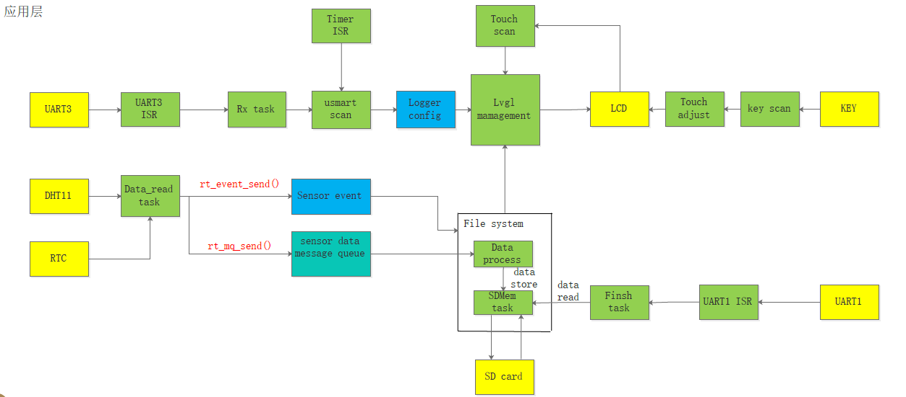

<!--
 * @Descripttion:
 * @version: 1.0
 * @Author: YLDS
 * @Date: 2021-04-29 20:35:53
 * @LastEditTime: 2021-04-29 23:11:11
-->

# 温湿度数据记录分析仪

基于 STM32F407 的温湿度数据记录分析仪，使用 RT-Thread 操作系统和 Littlevgl 开源 GUI 库设计制作，通过 DHT11 获取温湿度信息，并且使用文件系统每分钟将温湿度信息存到 SD 卡中。

系统运行逻辑图如下:

## 使用说明

1. 使用正点原子探索者开发板和 2.8 寸 LCD 屏，移植了RT-Thread标准版4.0.3版本和LittleVGL V6。
2. 文件系统使用 RT-Thread 提供的虚拟文件系统组件 DFS，首先将 SPI FLASH 挂载到"/"下，然后 SD 卡挂载在"/sdcard"路径下，这样没有 SD 卡也可以直接使用外部 FLASH。
3. LittleVGL设置的GUI界面参考了正点原子推出的教程所制作，有兴趣的可以去学习一下正点原子的[视频](http://www.openedv.com/docs/book-videos/zdyzshipin/4free/littleVGL.html)。
4. 主要包括了日历、时间、温湿度图表显示、文件系统查看等功能。
